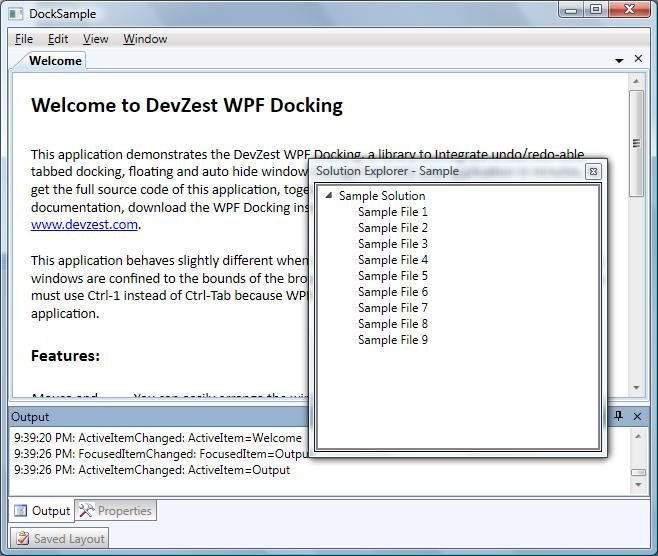
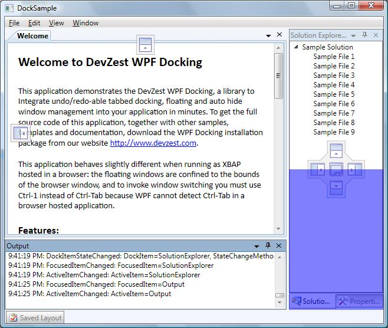
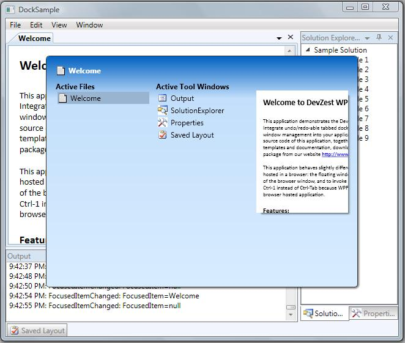

# Welcome to DevZest WPF Docking

WPF Docking is a docking library to integrate undo/redo-able tabbed docking, floating and auto hide window management into your application in minutes.

## Summary

### **Fully featured docking** window management mimics Microsoft Visual Studio

Forget about the window layout and let WPF Docking to manage your application windows just like Microsoft Visual Studio: window can be docked to the sides of main window or other window,  floated above the main window, or tabbed; when docked to the sides of main window, window can auto hide to preserve the screen. End user can drag and drop to rearrange the layout, or switch between windows using the keyboard. The whole window layout, including the sequence of activation, can be saved, persisted, and loaded at a later time.

### **Undo/redo** the docking window layout changes

Make your application more user friendly to allow the end user to undo/redo the window layout change! One of the pieces of functionality that users expect to see but is often overlooked, perhaps because it is hard to implement, is undo/redo. Our layout engine takes this burden off your shoulder easily.

### **XBAP** compatible

Our product is written in 100% managed code, and can gracefully degrade itself to run under partial trust, without loosing any functionality. The only restrictions are: the floating windows are confined to the bounds of the browser window, and to invoke window switching you must use Ctrl-1 instead of Ctrl-Tab because WPF cannot detect Ctrl-Tab in a browser hosted application (The hot key can easily be customized).

### **Clean implementation** and **fully customizable**

Our API is well designed as simple and easy to use. You can write simple and intuitive XAML code; or you only need to remember one overloaded method, DockItem.Show, to achieve any window layout in your code behind. Our layout engine (the docking logic) is completely seperated from the presentation (the UI). The layout engine implementation has absolutely no idea about the presentation implementation - no PART_xxxx magic! This makes our product more robust and fully customizable.

## Screenshots

Tabbed docking, floating and auto-hide window:

Drag-and-drop to arrange window layout:

Window switcher:

## How to Use

- Create a project in Visual Studio or other IDE, targeting .Net Framework 3.5 or later;
- Add nuget package [DevZest.WpfDocking](https://www.nuget.org/packages/DevZest.WpfDocking/) to your project.
- Documentation available: [Programming Guide](xref:getting_started) and [Class Library](xref:DevZest.Windows.Docking)
- Source code available: [https://github.com/DevZest/WpfDocking](https://github.com/DevZest/WpfDocking).
- Samples available: [https://github.com/DevZest/WpfDocking.Samples](https://github.com/DevZest/WpfDocking.Samples).